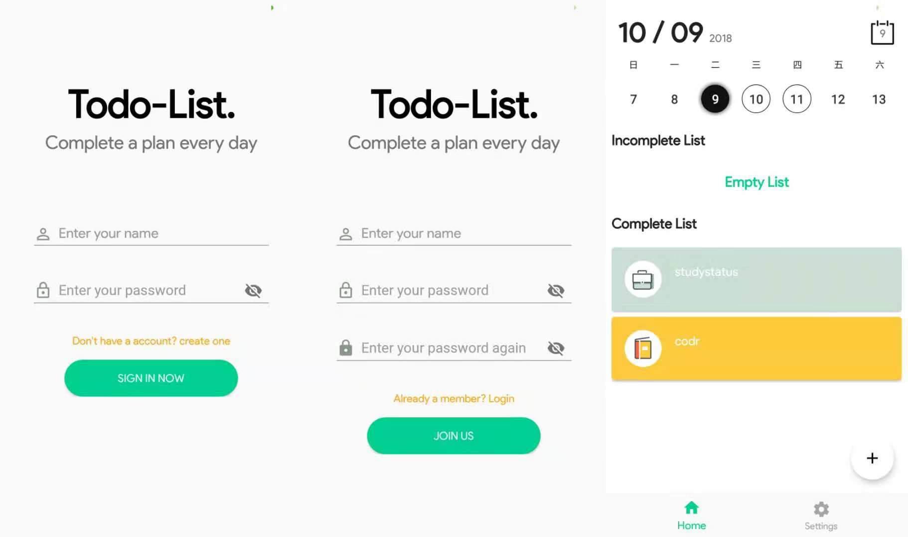
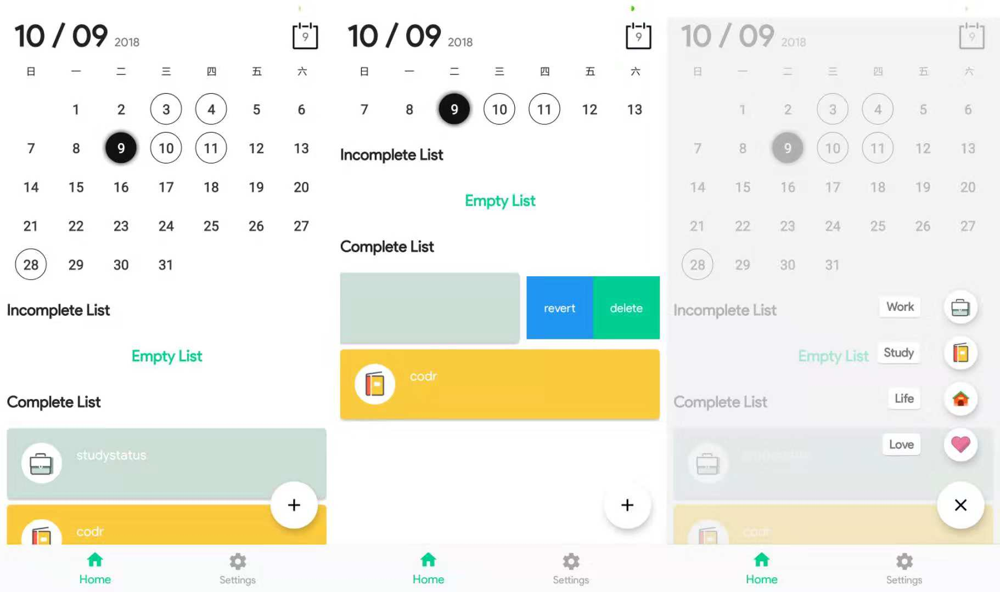

# WanAndroidTodo
An Android app for http://www.wanandroid.com/lg/todo/list/0

<div align="center">
	
</div>

WanAndroidTodo App aims to help people make schedules more efficiently, which is designed with Material Design style, built on MVVM architecture with Retrofit2, Room database, LiveData, ViewModel, Kotlin Coroutines.

The source code in the repository reflects the app which supports mobile devices running Android 8.0+.

### About This Repository And App

This app is using the WanAndroidTodo API[(doc)](http://www.wanandroid.com/blog/show/2) designed by [HongYang](https://github.com/hongyangAndroid).

### Screenshots





Clone the Repository:

```
git clone https://github.com/CoderLengary/WanAndroidTodo.git
```

Check out the master branch:

```
git checkout master
```

Suggestion: It is better for you to update your Android Studio to version 3.1.2 when you open this project.

### Libraries Used in This App
Name | Introduction
----- | ------ 
[Android Support Libraries](https://developer.android.com/topic/libraries/support-library/alphabet.html) | The Android Support Library offers a number of features that are not built into the framework. These libraries offer backward-compatible versions of new features, provide useful UI elements that are not included in the framework, and provide a range of utilities that apps can draw on. 
[CircleImageView](https://github.com/hdodenhof/CircleImageView) | A circular ImageView for Android 
[Room](https://developer.android.com/topic/libraries/architecture/room.html) | Room provides an abstraction layer over SQLite to allow fluent database access while harnessing the full power of SQLite. 
[Retrofit](https://github.com/square/retrofit) | Type-safe HTTP client for Android and Java by Square, Inc. 
[Calendar](https://github.com/huanghaibin-dev/CalendarView) | A useful and efficient calendar view.
[FloatingActionButtonSpeedDial](https://github.com/leinardi/FloatingActionButtonSpeedDial) | A Floating Action Button Speed Dial implementation for Android that follows the Material Design specification.
[Coroutines](https://github.com/Kotlin/kotlinx.coroutines) | Library support for Kotlin coroutines.
### Thanks to
+ [TonnyL](https://github.com/TonnyL) Really appreciate his help!
+ [WanAndroid](http://www.wanandroid.com)

### License
```
Copyright 2018 CoderLengary

Licensed under the Apache License, Version 2.0 (the "License");
you may not use this file except in compliance with the License.
You may obtain a copy of the License at

    http://www.apache.org/licenses/LICENSE-2.0

Unless required by applicable law or agreed to in writing, software
distributed under the License is distributed on an "AS IS" BASIS,
WITHOUT WARRANTIES OR CONDITIONS OF ANY KIND, either express or implied.
See the License for the specific language governing permissions and
limitations under the License.
```
